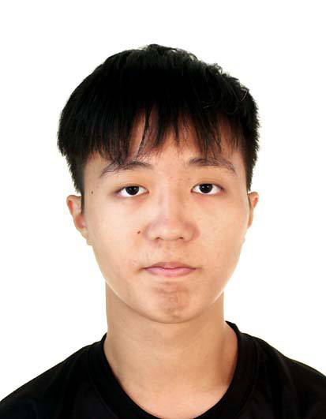

We are a team based in the [School of Computing, National University of Singapore](https://www.comp.nus.edu.sg).

You can reach us at the email `seer[at]comp.nus.edu.sg`

## Project team

### Popova Mariia

[[homepage](http://www.comp.nus.edu.sg/~damithch)]
[[github](https://github.com/johndoe)]
[[portfolio](team/johndoe.md)]

* Role: Deliverables and deadlines
* Responsibilities: Ensure project deliverables are done on time and in the right format.
  Integration: In charge of versioning of the code, maintaining the code repository, integrating various parts of the software to create a whole.

### Dong Haoyu

[[github](http://github.com/engulfy)]
[[portfolio](team/johndoe.md)]

* Role: Testing
* Responsibilities: Ensures the testing of the project is done properly and on time.

### Johnny Doe

[[github](http://github.com/johndoe)] [[portfolio](team/johndoe.md)]

* Role: Developer
* Responsibilities: Data

### Jean Doe

[[github](http://github.com/johndoe)]
[[portfolio](team/johndoe.md)]

* Role: Developer
* Responsibilities: Dev Ops + Threading

### Sankar Niharika

[[github](http://github.com/niha81)]
[[portfolio](team/johndoe.md)]

* Role: Deliverables and deadlines
* Responsibilities: Ensure project deliverables are done on time and in the right format.

### Ming Sheng

[[github](http://github.com/moingshoing)]
[[portfolio](team/johndoe.md)]

* Role: Code quality
* Responsibilities: Looks after code quality, ensures adherence to coding standards, etc.

