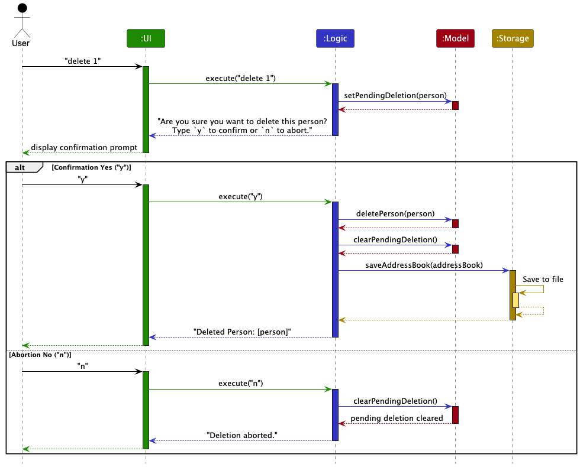
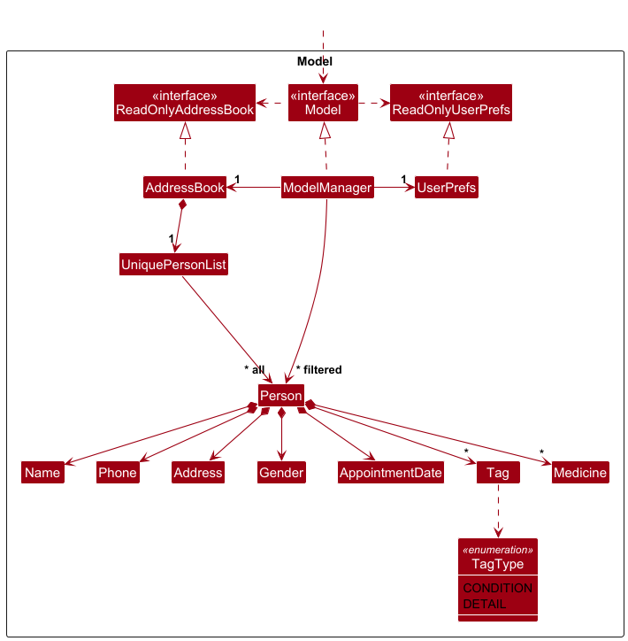
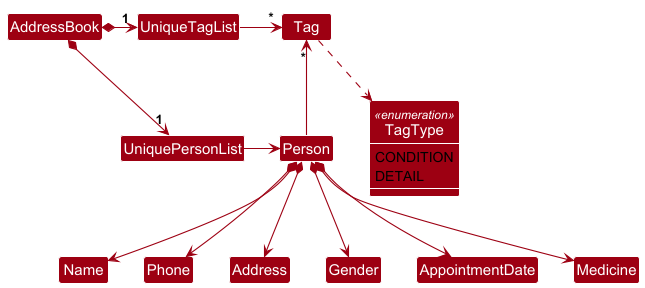
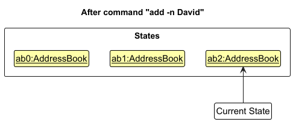
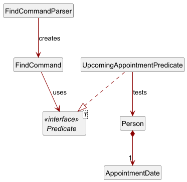

* Table of Contents
{:toc}

--------------------------------------------------------------------------------------------------------------------

## **Acknowledgements**

* {list here sources of all reused/adapted ideas, code, documentation, and third-party libraries -- include links to the original source as well}

--------------------------------------------------------------------------------------------------------------------

## **Setting up, getting started**

Refer to the guide [_Setting up and getting started_](SettingUp.md).

--------------------------------------------------------------------------------------------------------------------

## **Design**

:bulb: **Tip:** The `.puml` files used to create diagrams in this document `docs/diagrams` folder. Refer to the [_PlantUML Tutorial_ at se-edu/guides](https://se-education.org/guides/tutorials/plantUml.html) to learn how to create and edit diagrams.

### Architecture

The ***Architecture Diagram*** given above explains the high-level design of the App.

Given below is a quick overview of main components and how they interact with each other.

**Main components of the architecture**

**`Main`** (consisting of classes [`Main`](https://github.com/se-edu/addressbook-level3/tree/master/src/main/java/seedu/address/Main.java) and [`MainApp`](https://github.com/se-edu/addressbook-level3/tree/master/src/main/java/seedu/address/MainApp.java)) is in charge of the app launch and shut down.
* At app launch, it initializes the other components in the correct sequence, and connects them up with each other.
* At shut down, it shuts down the other components and invokes cleanup methods where necessary.

The bulk of the app's work is done by the following four components:

* [**`UI`**](#ui-component): The UI of the App.
* [**`Logic`**](#logic-component): The command executor.
* [**`Model`**](#model-component): Holds the data of the App in memory.
* [**`Storage`**](#storage-component): Reads data from, and writes data to, the hard disk.

[**`Commons`**](#common-classes) represents a collection of classes used by multiple other components.

**How the architecture components interact with each other**

The *Sequence Diagram* below shows how the components interact with each other for the scenario where the user issues the command `delete 1`.

Each of the four main components (also shown in the diagram above),

* defines its *API* in an `interface` with the same name as the Component.
* implements its functionality using a concrete `{Component Name}Manager` class (which follows the corresponding API `interface` mentioned in the previous point.

For example, the `Logic` component defines its API in the `Logic.java` interface and implements its functionality using the `LogicManager.java` class which follows the `Logic` interface. Other components interact with a given component through its interface rather than the concrete class (reason: to prevent outside component's being coupled to the implementation of a component), as illustrated in the (partial) class diagram below.

The sections below give more details of each component.

### UI component

The **API** of this component is specified in [`Ui.java`](https://github.com/se-edu/addressbook-level3/tree/master/src/main/java/seedu/address/ui/Ui.java)

The UI consists of a `MainWindow` that is made up of parts e.g.`CommandBox`, `ResultDisplay`, `PersonListPanel`, `StatusBarFooter` etc. All these, including the `MainWindow`, inherit from the abstract `UiPart` class which captures the commonalities between classes that represent parts of the visible GUI.

The `UI` component uses the JavaFx UI framework. The layout of these UI parts are defined in matching `.fxml` files that are in the `src/main/resources/view` folder. For example, the layout of the [`MainWindow`](https://github.com/se-edu/addressbook-level3/tree/master/src/main/java/seedu/address/ui/MainWindow.java) is specified in [`MainWindow.fxml`](https://github.com/se-edu/addressbook-level3/tree/master/src/main/resources/view/MainWindow.fxml)

The `UI` component,

* executes user commands using the `Logic` component.
* listens for changes to `Model` data so that the UI can be updated with the modified data.
* keeps a reference to the `Logic` component, because the `UI` relies on the `Logic` to execute commands.
* depends on some classes in the `Model` component, as it displays `Person` object residing in the `Model`.

### Logic component

**API** : [`Logic.java`](https://github.com/se-edu/addressbook-level3/tree/master/src/main/java/seedu/address/logic/Logic.java)

Here's a (partial) class diagram of the `Logic` component:

The sequence diagram below illustrates the interactions within the `Logic` component, taking `execute("delete 1")` API call as an example.

:information_source: **Note:** The lifeline for `DeleteCommandParser` should end at the destroy marker (X) but due to a limitation of PlantUML, the lifeline continues till the end of diagram.

How the `Logic` component works:

1. When `Logic` is called upon to execute a command, it is passed to an `AddressBookParser` object which in turn creates a parser that matches the command (e.g., `DeleteCommandParser`) and uses it to parse the command.
1. This results in a `Command` object (more precisely, an object of one of its subclasses e.g., `DeleteCommand`) which is executed by the `LogicManager`.
1. The command can communicate with the `Model` when it is executed (e.g. to delete a person). 
   Note that although this is shown as a single step in the diagram above (for simplicity), in the code it can take several interactions (between the command object and the `Model`) to achieve.
1. The result of the command execution is encapsulated as a `CommandResult` object which is returned back from `Logic`.

Here are the other classes in `Logic` (omitted from the class diagram above) that are used for parsing a user command:

How the parsing works:
* When called upon to parse a user command, the `AddressBookParser` class creates an `XYZCommandParser` (`XYZ` is a placeholder for the specific command name e.g., `AddCommandParser`) which uses the other classes shown above to parse the user command and create a `XYZCommand` object (e.g., `AddCommand`) which the `AddressBookParser` returns back as a `Command` object.
* All `XYZCommandParser` classes (e.g., `AddCommandParser`, `DeleteCommandParser`, ...) inherit from the `Parser` interface so that they can be treated similarly where possible e.g, during testing.

### Model component
**API** : [`Model.java`](https://github.com/se-edu/addressbook-level3/tree/master/src/main/java/seedu/address/model/Model.java)

The `Model` component,

* stores the address book data i.e., all `Person` objects (which are contained in a `UniquePersonList` object).
* stores the currently 'selected' `Person` objects (e.g., results of a search query) as a separate _filtered_ list which is exposed to outsiders as an unmodifiable `ObservableList<Person>` that can be 'observed' e.g. the UI can be bound to this list so that the UI automatically updates when the data in the list change.
* stores a `UserPref` object that represents the user’s preferences. This is exposed to the outside as a `ReadOnlyUserPref` objects.
* does not depend on any of the other three components (as the `Model` represents data entities of the domain, they should make sense on their own without depending on other components)

:information_source: **Note:** An alternative (arguably, a more OOP) model is given below. It has a `Tag` list in the `AddressBook`, which `Person` references. This allows `AddressBook` to only require one `Tag` object per unique tag, instead of each `Person` needing their own `Tag` objects. 

### Storage component

**API** : [`Storage.java`](https://github.com/se-edu/addressbook-level3/tree/master/src/main/java/seedu/address/storage/Storage.java)

The `Storage` component,
* can save both address book data and user preference data in JSON format, and read them back into corresponding objects.
* inherits from both `AddressBookStorage` and `UserPrefStorage`, which means it can be treated as either one (if only the functionality of only one is needed).
* depends on some classes in the `Model` component (because the `Storage` component's job is to save/retrieve objects that belong to the `Model`)

### Common classes

Classes used by multiple components are in the `seedu.address.commons` package.

--------------------------------------------------------------------------------------------------------------------

## **Implementation**

This section describes some noteworthy details on how certain features are implemented.

### \[Proposed\] Undo/redo feature

#### Proposed Implementation

The proposed undo/redo mechanism is facilitated by `VersionedAddressBook`. It extends `AddressBook` with an undo/redo history, stored internally as an `addressBookStateList` and `currentStatePointer`. Additionally, it implements the following operations:

* `VersionedAddressBook#commit()` — Saves the current address book state in its history.
* `VersionedAddressBook#undo()` — Restores the previous address book state from its history.
* `VersionedAddressBook#redo()` — Restores a previously undone address book state from its history.

These operations are exposed in the `Model` interface as `Model#commitAddressBook()`, `Model#undoAddressBook()` and `Model#redoAddressBook()` respectively.

Given below is an example usage scenario and how the undo/redo mechanism behaves at each step.

Step 1. The user launches the application for the first time. The `VersionedAddressBook` will be initialized with the initial address book state, and the `currentStatePointer` pointing to that single address book state.

Step 2. The user executes `delete 5` command to delete the 5th person in the address book. The `delete` command calls `Model#commitAddressBook()`, causing the modified state of the address book after the `delete 5` command executes to be saved in the `addressBookStateList`, and the `currentStatePointer` is shifted to the newly inserted address book state.

Step 3. The user executes `add n/David …​` to add a new person. The `add` command also calls `Model#commitAddressBook()`, causing another modified address book state to be saved into the `addressBookStateList`.

:information_source: **Note:** If a command fails its execution, it will not call `Model#commitAddressBook()`, so the address book state will not be saved into the `addressBookStateList`.

Step 4. The user now decides that adding the person was a mistake, and decides to undo that action by executing the `undo` command. The `undo` command will call `Model#undoAddressBook()`, which will shift the `currentStatePointer` once to the left, pointing it to the previous address book state, and restores the address book to that state.

:information_source: **Note:** If the `currentStatePointer` is at index 0, pointing to the initial AddressBook state, then there are no previous AddressBook states to restore. The `undo` command uses `Model#canUndoAddressBook()` to check if this is the case. If so, it will return an error to the user rather
than attempting to perform the undo.

The following sequence diagram shows how an undo operation goes through the `Logic` component:

:information_source: **Note:** The lifeline for `UndoCommand` should end at the destroy marker (X) but due to a limitation of PlantUML, the lifeline reaches the end of diagram.

Similarly, how an undo operation goes through the `Model` component is shown below:

The `redo` command does the opposite — it calls `Model#redoAddressBook()`, which shifts the `currentStatePointer` once to the right, pointing to the previously undone state, and restores the address book to that state.

:information_source: **Note:** If the `currentStatePointer` is at index `addressBookStateList.size() - 1`, pointing to the latest address book state, then there are no undone AddressBook states to restore. The `redo` command uses `Model#canRedoAddressBook()` to check if this is the case. If so, it will return an error to the user rather than attempting to perform the redo.

Step 5. The user then decides to execute the command `list`. Commands that do not modify the address book, such as `list`, will usually not call `Model#commitAddressBook()`, `Model#undoAddressBook()` or `Model#redoAddressBook()`. Thus, the `addressBookStateList` remains unchanged.

Step 6. The user executes `clear`, which calls `Model#commitAddressBook()`. Since the `currentStatePointer` is not pointing at the end of the `addressBookStateList`, all address book states after the `currentStatePointer` will be purged. Reason: It no longer makes sense to redo the `add n/David …​` command. This is the behavior that most modern desktop applications follow.

The following activity diagram summarizes what happens when a user executes a new command:

#### Design considerations:

**Aspect: How undo & redo executes:**

* **Alternative 1 (current choice):** Saves the entire address book.
  * Pros: Easy to implement.
  * Cons: May have performance issues in terms of memory usage.

* **Alternative 2:** Individual command knows how to undo/redo by
  itself.
  * Pros: Will use less memory (e.g. for `delete`, just save the person being deleted).
  * Cons: We must ensure that the implementation of each individual command are correct.

_{more aspects and alternatives to be added}_

### Find upcoming appointments

The `upcoming` feature under the `find` command allows users to filter and display only those persons who have future appointments scheduled. This functionality is useful for quickly identifying clients with pending appointments.

#### Overview

* Command format: `find upcoming`
* Filters out persons whose appointment dates are **before or equal** to the current date and time.
* Supports both date-only and full datetime formats (e.g., `2025-04-01` or `2025-04-01 14:30`).

#### Key Classes & Logic

1. `FindCommandParser`
    * Detects if the user input is exactly `"upcoming"` (case-insensitive).
    * If matched, it returns a `FindCommand` initialized with an `UpcomingAppointmentPredicate`.
    * This diverges from the usual `-n` (name) or `-d` (appointment date) prefixes.
2. `UpcomingAppointmentPredicate`
    * Implements `Predicate<Person>`.
    * Extracts the `appointmentDate` from each `Person`.
    * Attempts to parse the string as either:
      * a full datetime using format `yyyy-MM-dd HH:mm`, or
      * a date-only format `yyyy-MM-dd` (defaults to `00:00` for comparison).
    * Compares the parsed result to `LocalDateTime.now()` and returns `true` only if the appointment is strictly after the current moment.
3. `AppointmentDate`
   * Normalizes and validates user-inputted date strings.
   * Accepts and validates both formats using regex and Java's `DateTimeFormatter`.
   * Helps maintain consistent formatting throughout the system.
4. `FindCommand`
   * When executed, it passes the predicate to the model's `updateFilteredPersonList()`, causing the filtered list to update with only persons matching the predicate.

The following class diagram shows the relationship between key classes involved:

#### Design Considerations

* **Fault Tolerance:** Any parsing errors during predicate evaluation result in a safe `false` return, preventing the app from crashing.
* **Extensibility:** This approach cleanly separates predicates, allowing future filters (e.g., "past appointments", "appointments this week") to be added by introducing new `Predicate<Person>` classes.
* **Single Responsibility:** Each class follows the SRP principle—e.g., `FindCommandParser` handles parsing, `UpcomingAppointmentPredicate` handles logic, and `AppointmentDate` handles formatting.

--------------------------------------------------------------------------------------------------------------------

## **Documentation, logging, testing, configuration, dev-ops**

* [Documentation guide](Documentation.md)
* [Testing guide](Testing.md)
* [Logging guide](Logging.md)
* [Configuration guide](Configuration.md)
* [DevOps guide](DevOps.md)

--------------------------------------------------------------------------------------------------------------------

## **Appendix: Requirements**

### Product scope

**Target user profile**:

* nurses who do home visits for elderly patients
* has a need to manage a significant number of contacts
* is reasonably comfortable using CLI apps

**Value proposition**: The app will help nurses caring for elderly patients manage contact details of their home-visit patients within one platform.

### User stories

Priorities: High (must have) - `* * *`, Medium (nice to have) - `* *`, Low (unlikely to have) - `*`

| Priority | As a …​                                     | I want to …​                                                    | So that I can…​                                                 |
|----------|---------------------------------------------|-----------------------------------------------------------------|-----------------------------------------------------------------|
| `* * *`  | user                                        | see usage instructions                                          | refer to instructions when I forget how to use the App          |
| `* * *`  | new user                                    | see a quick-start guide                                         | learn how to use the app effectively from the beginning         |
| `* * *`  | user                                        | add a new patient’s contact details                             | keep track of their information and reach out when needed       |
| `* * *`  | home-visit nurse managing multiple patients | update a patient's contact details                              | always have the latest information to reach them                |
| `* * *`  | user                                        | delete a person                                                 | remove entries that I no longer need                            |
| `* * *`  | user                                        | see a confirmation message before deleting a patient record     | avoid accidentally removing important data                      |
| `* * *`  | home-visit nurse managing multiple patients | search for a patient by name and view their details quickly     | find important information efficiently during a visit           |
| `* * *`  | user                                        | search for a patient using partial names                        | find a patient even if I don’t remember their full name         |
| `* * *`  | user                                        | have search results highlight matching text                     | quickly identify relevant records                               |
| `* * *`  | user                                        | list all patients                                               | get an overview of all stored records                           |
| `* *`    | home-visit nurse with many patients         | sort my patient list by name                                    | locate a person easily                                          |
| `* *`    | home-visit nurse                            | filter search results by appointment date                       | quickly locate patients I am scheduled to see soon              |
| `* *`    | user                                        | search for patients by phone number                             | retrieve contact details even if I only have a number available |
| `* *`    | security-conscious user                     | lock or hide sensitive patient contact details                  | prevent unauthorized individuals from accessing them            |
| `*`      | busy nurse                                  | categorize patients based on their conditions or priority level | focus on urgent cases first                                     |
| `*`      | home-visit nurse with many patients         | filter my patient list by location                              | optimize my travel schedule for house visits                    |

*{More to be added}*

### Use cases

(For all use cases below, the **System** is the `SilverCare` and the **Actor** is the `nurse`, unless specified otherwise)

**Use Case 1: Add a new patient**

**Goal: Add a new patient’s contact and medical information.**

**MSS:**
1. Nurse provides the required patient information: name, phone number, address, and gender.
2. Nurse may also provide optional information: appointment date, medical condition, and additional notes.
3. System validates the data provided.
4. System checks whether a patient with same identifying details already exists.
5. System creates a new patient record and assigns it a unique ID.
6. System confirms addition and displays the new patient in the patient list.
7. Use case ends.
   
**Extensions:**
   * 2a. System detects invalid or incomplete entered data.
     * 2a1. System requests for the correct data.
     * 2a2. Nurse enters new data
     * Steps 2a1-2a2 are repeated until the data entered are correct.
     * Use case resumes from step 3.
   * 3a. System detects duplicate patient
     * 3a1. System informs Nurse that the patient already exists.
     * 3a2. System cancels the add request.
     * Use case ends.

**Use case 2: Delete an existing patient**

**Goal: Delete an existing patient’s contact and medical information.**

**MSS**

1. Nurse requests to delete an existing patient contact.
2. Nurse provides the patient's unique ID.
3. System validates the provided patient ID.
4. If valid, System prompts Nurse to confirm the deletion.
5. Nurse confirms the deletion.
6. System deletes the corresponding patient record.
7. System informs Nurse that the deletion is successful.
8. Use case ends.

**Extensions**

* 3a. System detects invalid patient ID.
    * 3a1. System requests for the correct data.
    * 3a2. Nurse enters new data
    * Steps 3a1-3a2 are repeated until the data entered are correct.
    * Use case resumes from step 4.

* 3b. System does not find a patient with the provided ID.
    * 3b1. System informs the Nurse that no matching patient exists.
    * 3b2. System requests a different patient ID. 
    * 3b3. Nurse provides a new patient ID. 
    * Steps 3b1–3b3 are repeated until a matching patient is found.
    * Use case resumes from step 4.

* 4a. Nurse cancels deletion.
    * Nurse declines the confirmation prompt.
    * System informs Nurse that the deletion has been cancelled.
    * Use case ends.

**Use case 3: Find a patient by name**

**Goal: Search for a patient’s record by their name.**

**MSS**

1. Nurse requests to search for a patient by name.
2. Nurse provides a name to search for.
3. System validates the provided name (e.g., non-empty, valid characters).
4. System searches for patient records containing the name (case-insensitive).
5. System displays a list of matching patient records.
6. Use case ends.

**Extensions**

* 3a. Nurse provides empty name query.
    * 3a1. System informs the Nurse that the name cannot be empty.
    * 3a2. System requests a valid name.
    * 3a3. Nurse provides a new search name.
    * Steps 3a1–3a3 are repeated until a valid name is entered.
    * Use case resumes from step 4.

* 3b. Nurse provides invalid name query.
    * 3b1. System informs the Nurse that the name format is invalid.
    * 3b2. System requests a valid name.
    * 3b3. Nurse provides a new search name.
    * Steps 3b1–3b3 are repeated until a valid name is entered.
    * Use case resumes from step 4.

* 4a. No matching patient records found.
    * 4a1. System informs the Nurse that no matching records were found.
    * 4a2. System requests a new search input.
    * 4a3. Nurse provides a new search name.
    * Steps 4a1–4a3 are repeated until a match is found or the search is cancelled.
    * Use case resumes from step 4 or ends if cancelled.

**Use case 4: Find a patient by appointment date**

**Goal: Search for a patient’s record by appointment date.**

**MSS**

1. Nurse requests to search for a patient by appointment date.
2. Nurse provides a date to search for.
3. System validates the provided date format.
4. System searches for patient records with matching appointment dates.
5. System displays a list of matching patient records.
6. Use case ends.

**Extensions**

* 3a. Nurse provides empty name query.
    * 3a1. System informs the Nurse that the appointment date cannot be empty.
    * 3a2. System requests a valid date input.
    * 3a3. Nurse provides a new date.
    * Steps 3a1–3a3 are repeated until a valid name is entered.
    * Use case resumes from step 4.

* 3b. Nurse provides invalid name query.
    * 3b1. System informs the Nurse that the name format is invalid.
    * 3b2. System requests a valid date input.
    * 3b3. Nurse provides a new date.
    * Steps 3b1–3b3 are repeated until a valid name is entered.
    * Use case resumes from step 4.

* 4a. No matching patient records found.
    * 4a1. System informs the Nurse that no matching records were found.
    * 4a2. System requests a new search input.
    * 4a3. Nurse provides a new date.
    * Steps 4a1–4a3 are repeated until a match is found or the search is cancelled.
    * Use case resumes from step 4 or ends if cancelled.

**Use case 5: Find upcoming appointments**

**Goal: Retrieve all patient records with appointment dates that are scheduled after the current system time.**

**MSS**

1. Nurse requests to view upcoming appointments.
2. System retrieves the current date and time.
3. System searches for all patients whose appointment dates are scheduled after the current system time.
4. System displays a list of matching patient records.
5. Use case ends.

**Extensions**

* 3a. No upcoming appointments found.
    * 3a1. System informs Nurse that there are no upcoming appointments.
    * Use case ends.

**Use case 6: Edit a patient record**

**Goal: Modify an existing patient's contact or medical information.**

**MSS**

1. Nurse requests to edit a patient record
2. Nurse provides the patient ID and specifies one or more fields to update (e.g., name, phone, address, gender, etc.).
3. System validates the patient ID and each field to be updated.
4. System updates the patient record with the new information.
5. System confirms the successful update.
6. Use case ends.

**Extensions**

* 3a. Invalid patient ID provided 
    * 3a1. System informs Nurse that the patient ID is invalid or not found.
    * 3a2. System requests a valid patient ID.
    * 3a3. Nurse provides a new ID.
    * Steps 3a1–3a3 repeat until a valid patient ID is provided.
    * Use case resumes from step 3.

* 3b. Invalid input for one or more fields 
    * 3b1. System informs the Nurse of each invalid field and the corresponding format or constraint.
    * 3b2. System requests corrected values for the invalid fields.
    * 3b3. Nurse provides corrected input.
    * Steps 3b1–3b3 repeat until all inputs are valid.
    * Use case resumes from step 4.

* 4a. No changes detected 
    * 4a1. If the new values are the same as the existing ones, System informs Nurse that no updates were made.
    * Use case ends.

**Use case 7: Clear all patient records**

**Goal: Remove all existing patient records from the system.**

**MSS**

1. Nurse requests to clear all patient records.
2. System prompts Nurse for confirmation before proceeding.
3. Nurse confirms the action.
4. System deletes all patient records from the system.
5. System informs Nurse that the address book has been cleared.
6. Use case ends.

**Extensions**

* 3a. Nurse cancels the clear request
    * 3a1. Nurse declines the confirmation prompt.
    * 3a2. System informs Nurse that the clear action has been cancelled.
    * Use case ends.

* 4a. No records to clear
    * 4a1. System detects that there are no patient records to delete.
    * 4a2. System informs the Nurse that the address book is already empty.
    * Use case ends.

**Use case 8: List all patients**

**Goal: View all active patient records.**

**MSS**

1. Nurse requests to view all patient records.
2. System retrieves all stored patient records.
3. System displays the list of patients.
4. Use case ends.

**Extensions**

* 2a. No patients found in the system.
    * 2a1. System informs the Nurse that there are no patient records available.
    * Use case ends.

**Use case 9: Toggle application theme**

**Goal: Switch the application’s appearance between light and dark mode.**

**MSS**

1. Nurse toggles the application theme.
2. System determines the current theme (light or dark).
3. System switches to the opposite theme.
4. System applies the new theme across the user interface.
5. Use case ends.

**Use case 10: Display help information**

**Goal: Provide guidance to Nurse on how to use the system’s commands and features.**

**MSS**

1. Nurse requests to view help information.
2. System opens a help window.
3. System displays example commands and usage instructions.
4. System provides a hyperlink to view the full user guide.
5. Use case ends.

**Use case 11: Exit the application**

**Goal: Safely terminate the SilverCare application.**

**MSS**

1. Nurse requests to exit the application.
2. System saves any unsaved data.
3. System terminates the application.
4. Use case ends.

*{More to be added}*

### Non-Functional Requirements

1.  Should work on any _mainstream OS_ as long as it has Java `17` or above installed.
2.  Should be able to hold up to 20 entries without a noticeable sluggishness in performance for typical usage.
3.  A user with above average typing speed for regular English text (i.e. not code, not system admin commands) should be able to accomplish most of the tasks faster using commands than using the mouse.
4. The system should be able to search patient records within 2 seconds.
5. The interface should be accessible and navigable by nurses with basic training within 1 hour.
   The app should allow viewing patient details even without an internet connection.
6. The system’s user interface (UI) and documentation must be clear, comprehensive, and understandable for nurses and healthcare professionals without advanced IT skills.
7. The app is not required to connect to the hospital’s database

*{More to be added}*

### Glossary

* **Mainstream OS**: Windows, Linux, Unix, MacOS
* **User**: A home-visit nurse who interacts with the SilverCare system to manage patient information.
* **New User**: A first-time user of the system who may require guidance on how to use the application.
* **Home-Visit Nurse**: A nurse who provides medical care to elderly patients in their homes, rather than at a hospital or clinic.
* **Patient Management**: The ability to store, update, and retrieve patient details such as name, contact information, and medical history.
* **Contact Details**: A patient’s phone number, address, and any other means of communication stored within the system.
* **Private contact detail**: A contact detail that is not meant to be shared with others
* **Patient Record**: A stored entry containing a patient's personal details, contact information, and relevant medical notes.
* **Unique Identifier (Patient ID)**: A system-generated number assigned to each patient record to ensure easy identification and management.

--------------------------------------------------------------------------------------------------------------------

## **Appendix: Instructions for manual testing**

Given below are instructions to test the app manually.

:information_source: **Note:** These instructions only provide a starting point for testers to work on;
testers are expected to do more *exploratory* testing.

### Launch and shutdown

1. Initial launch

   1. Download the jar file and copy into an empty folder

   1. Double-click the jar file Expected: Shows the GUI with a set of sample contacts. The window size may not be optimum.

1. Saving window preferences

   1. Resize the window to an optimum size. Move the window to a different location. Close the window.

   1. Re-launch the app by double-clicking the jar file. 
       Expected: The most recent window size and location is retained.

1. _{ more test cases …​ }_

### Deleting a person

1. Deleting a person while all persons are being shown

   1. Prerequisites: List all persons using the `list` command. Multiple persons in the list.

   1. Test case: `delete 1` 
      Expected: First contact is deleted from the list. Details of the deleted contact shown in the status message. Timestamp in the status bar is updated.

   1. Test case: `delete 0` 
      Expected: No person is deleted. Error details shown in the status message. Status bar remains the same.

   1. Other incorrect delete commands to try: `delete`, `delete x`, `...` (where x is larger than the list size) 
      Expected: Similar to previous.

1. _{ more test cases …​ }_

### Saving data

1. Dealing with missing/corrupted data files

   1. _{explain how to simulate a missing/corrupted file, and the expected behavior}_

1. _{ more test cases …​ }_

--------------------------------------------------------------------------------------------------------------------

## **Appendix: Effort**

--------------------------------------------------------------------------------------------------------------------

## **Appendix: Planned Enhancements**