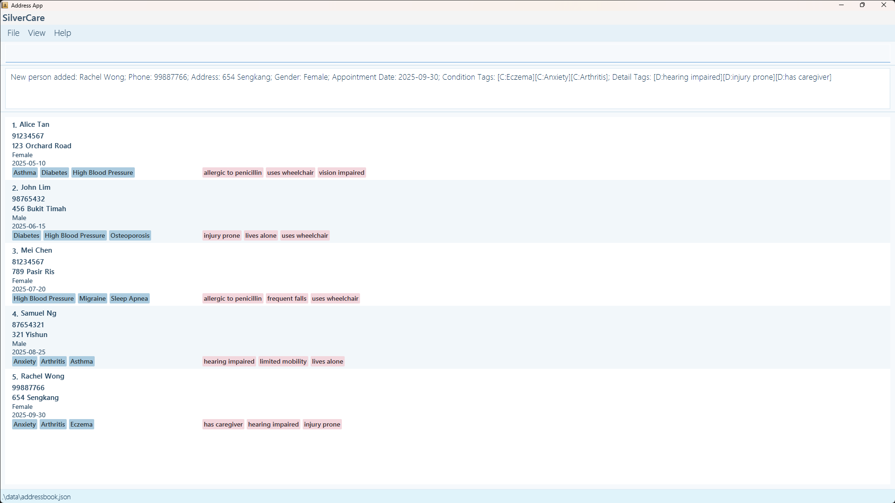
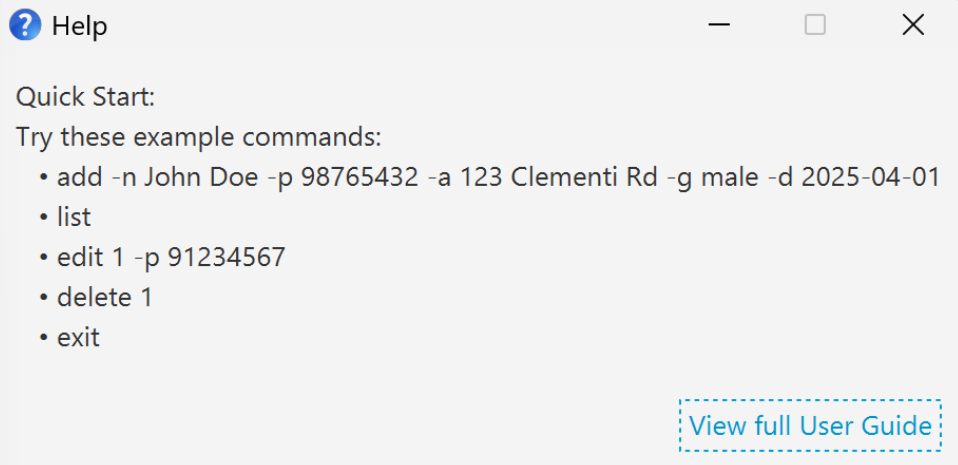
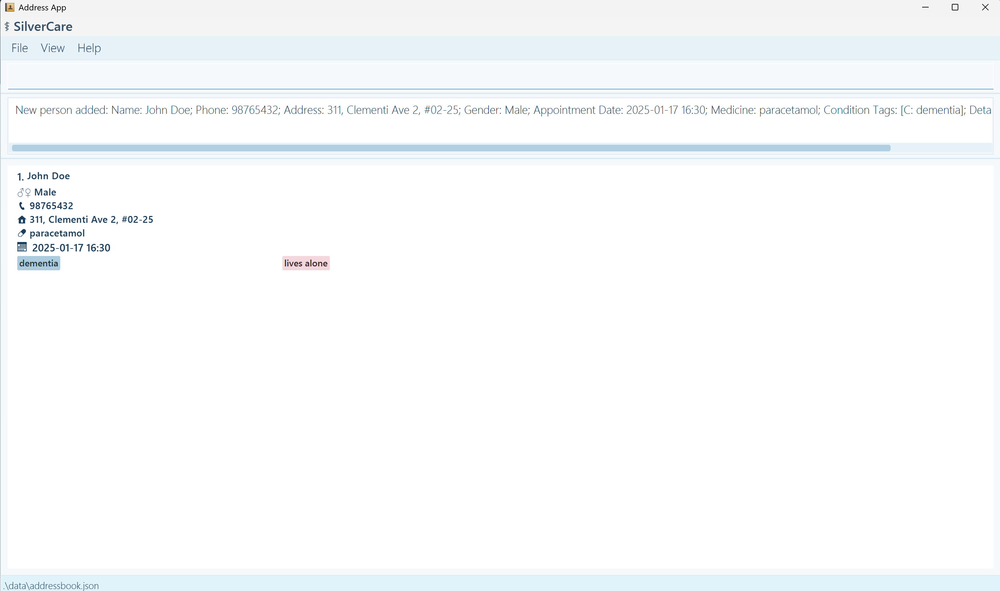
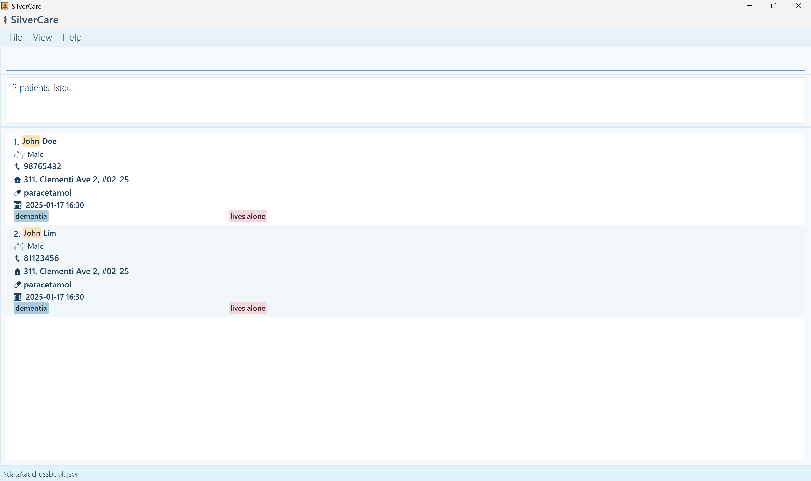
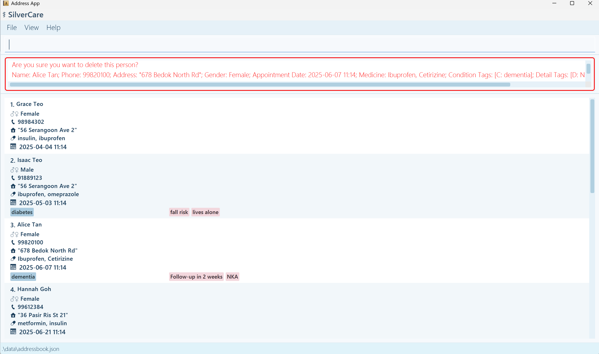
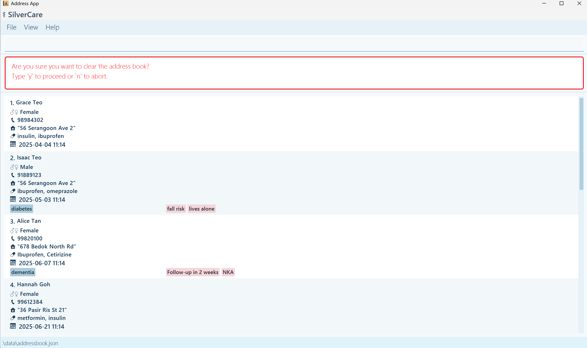
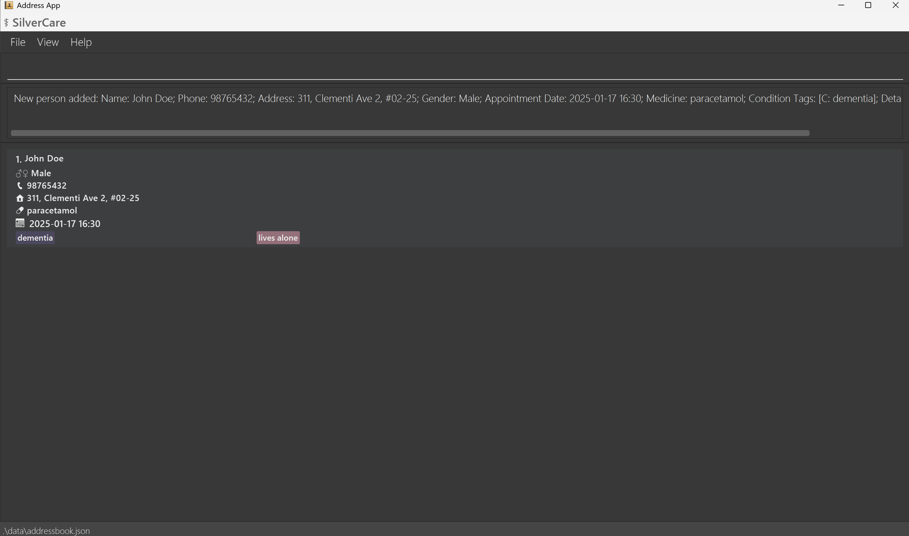
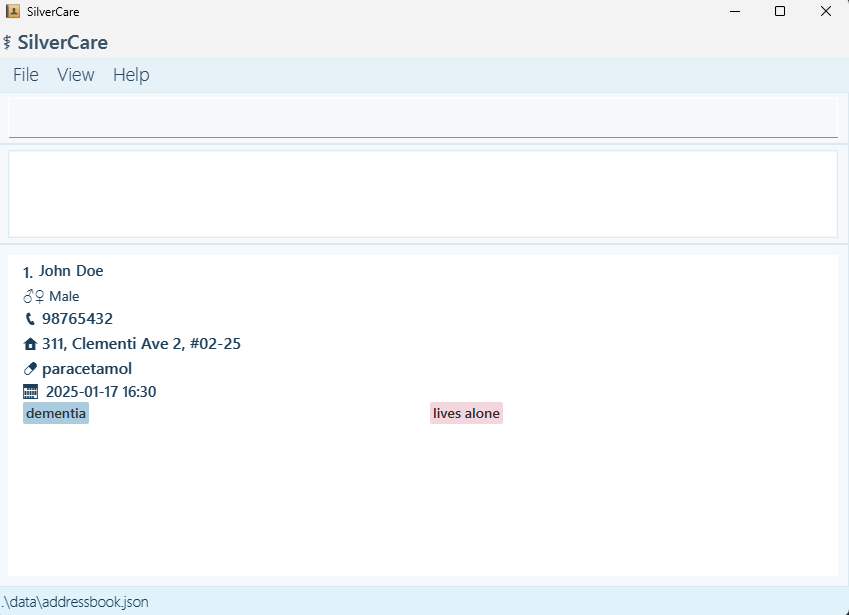

**Welcome to SilverCare!**

SilverCare is a **simple desktop app** that helps you keep track of your patients during home visits.
It’s built to be **fast** and **easy** to use, so you can spend less time on admin and more time with your patients.

Most actions, like adding a new patient or looking someone up, are done by typing **short commands**.
It might seem unfamiliar initially, but it becomes second nature with some practice.

There are also a few helpful buttons for things like getting help, changing the colour theme, or closing the app, just what you need, without the clutter.

* Table of Contents
{:toc}

--------------------------------------------------------------------------------------------------------------------

## Quick start

1. Check if Java is installed
   
    * Make sure your computer has Java 17 or above installed.
   
    * **Installation:** Please follow the installation instructions for [Windows](https://docs.oracle.com/en/java/javase/17/install/installation-jdk-microsoft-windows-platforms.html#GUID-DAF345BA-B3E7-4CF2-B87A-B6662D691840)/[Mac](https://se-education.org/guides/tutorials/javaInstallationMac.html)/[Linux](https://docs.oracle.com/en/java/javase/17/install/installation-jdk-linux-platforms.html) users.

2. Click [here](https://github.com/AY2425S2-CS2103T-T12-4/tp/releases) to download SilverCare's latest .jar file (this is the app).

3. Create a folder named ‘SilverCare’ in your Desktop.

4. Move the downloaded file into the folder.

5. Open the app
   * For Windows users, open Command Prompt and enter the following:
     1. `cd Desktop/SilverCare`
     
        OR `cd OneDrive/Desktop/SilverCare` if your Desktop is in OneDrive
     2. `java -jar silvercare.jar`
   * For Mac/Linux users, open Terminal and enter the following:
     1. `cd Desktop/SilverCare`
     2. `java -jar silvercare.jar`

   

6. Start fresh!

   When you first open SilverCare, you might see some sample patient data already filled in.
   To **clear** this and start with your own records just follow these simple steps:

   * Type `clear` and press **enter**
   * Follow the prompt and type `y` and press **enter** to clear the sample data!

7. Need [help](#viewing-help--help)? It’s always nearby
   
   You can open a quick help window anytime by:
   * **Typing:** `help`
   * **Pressing F1**, or
   * **Clicking the Help button**, followed by Help F1 button, at the top menu bar.

    The Help window shows example commands to get you started, and even includes a link back to this full user guide, so you can return here anytime if you need more details.

8. Explore more [features](#features) below
   
   Scroll down to learn how to add, search for, and manage your patients using simple commands.

9. You're ready to go! That’s it, SilverCare is set up and ready. Start managing your patient records with ease!

<blockquote style="color: #333333;">
  For a quick overview, check out our <a href="#command-summary">Command Summary</a>, which lists all the key commands in one place.
</blockquote>

--------------------------------------------------------------------------------------------------------------------

## Features

**:information_source: Notes on Command Format:** 

Before jumping into the features, here are a few simple tips on how commands work in SilverCare:

* Words in **CAPITAL LETTERS** are parameters that you need to fill in.
    
    **e.g.** `add -n NAME` means you should type something like `add -n John Doe` ([for full command](#command-summary)).
* Square brackets [ ] mean something is optional.

    **e.g.** `-n NAME [-c CONDITION]` can be used as `-n John Doe -c High BP` or just `-n John Doe`.
* Three dots (…​) mean you can include that part as many times as you need.

    **e.g.** `[-c CONDITION]…​` allows you to type nothing e.g. `-c` or `-c High BP -c Diabetic -c Asthma`
* Command parts can be entered in any order.

    So `-n John -p 91234567` and `-p 91234567 -n John` both function the same.
* Extra input won’t break commands like `list`, `help`, `exit`, or `clear`.

    **e.g.** `help 123` is treated the same as `help`. 
* All SilverCare commands are **case-sensitive**. Please use the lowercase command words exactly as shown in this guide.

* Command inputs containing other flags might cause unintended fields to be updated. Do not include spaces between the flag and the previous character in such cases.
    
    **e.g.** use `edit 1 -med panadol-cough syrup` instead of `edit 1 -med panadol -cough syrup` to edit medicine to `pandaol-cough syrup`.

<blockquote style="color: #333333;">
  <strong>Tip for PDF users:</strong> If you’re copying commands from a PDF version of this guide, double-check that no spaces are missing around line breaks, as sometimes PDF formatting removes them.  
  Also, be aware that some symbols (such as hyphens: <code>-</code>) might be substituted with similar-looking characters that may not work correctly in commands — if in doubt, retype these symbols.
</blockquote>

### Viewing help : `help`

Typing `help` opens a small window that gives you a quick overview of basic commands you can try out. It’s a great way to get started without needing to remember everything right away.

##### Need more info?

The Help window also has a **“View full User Guide”** button that links back to this page, so you can always come back here anytime you need more detailed instructions.

##### How to open the Help window:
* **Type**: `help`
* **Press F1** on your keyboard
* Or **click the Help button** in the top menu bar

--------------------------------------------------------------------------------------------------------------------

### Adding a person: `add`

Use this command to add a new patient to SilverCare.

**Command Format:**

`add -n NAME -p PHONE -a ADDRESS -g GENDER [-d APPOINTMENT DATE] [-c CONDITION]…​ [-det DETAIL]…​ [-med MEDICINE]`

##### Field options:

**Required Fields:**
* **-n NAME:** Patient’s full name
  
  Accepts 1 to 50 characters including alphanumeric characters, spaces, and common special characters:

  `, @ / ' . -`
  
  Example: `-n John O'Connor`, `-n Tan Mei-Ling`
* **-p PHONE:** Contact number
  
  Must be numeric and between 3 to 15 digits
  
  Example: `-p 91234567`, `-p 62345678`
* **-a ADDRESS:** Home address (e.g. 45 Bukit Timah Rd)
* **-g GENDER:** Gender

  Accepted values: male, female, m, f, M, F

  Example: `-g male`, `-g F`

**Optional Fields:**
* **-d APPOINTMENT DATE:** Appointment date

    Formats accepted: `yyyy-MM-dd` or `yyyy-MM-dd HH:mm` 
    
    Example: `-d 2025-04-10`, `-d 2025-04-10 14:30`

* **-c CONDITION:** Medical condition(s)

    Accepts alphanumeric input with spaces, apostrophes ('), and hyphens (-)

    Example: `-c High BP`, `-c Crohn's Disease`
    
    * You may include multiple conditions by repeating `-c`.

* **-det DETAIL:** Additional notes or details 

    Follows the same format rules as conditions

    Example: `-det lives alone`, `-det requires translator`

    * You may include multiple details by repeating `-det`.

* **-med MEDICINE:** Prescribed medicines

  Multiple items must be comma-separated in a single `-med` field.
  
  Example: `-med Panadol, Omeprazole`

  <strong>💡 Tips:</strong>
  <ul>
    <li>List all medicines as one string, separated by commas. (No need to repeat <code>-med</code> for each item.)</li>
    <li>A person can have any number of conditions and details (including 0).</li>
    <li>Exact duplicates in <code>-c</code> and <code>-det</code> will be treated as one entry. For example, entering <code>-c diabetes -c diabetes</code> adds only one condition.</li>
    <li>However, <code>-c High BP</code> and <code>-c high bp</code> are considered different due to case sensitivity, and both will be added.</li>
  </ul>

  <strong>⚠️ Important Notes:</strong>
  <ul>
    <li>You can store up to <strong>30 patients</strong> in SilverCare. Adding beyond this limit will not be allowed.</li>
    <li>Patients with the same <strong>name and phone number</strong> are treated as duplicates and trying to add them will result in an error.</li>
  </ul>

**Examples:**
* `add -n John Doe -p 98765432 -a 123 Clementi Rd -g male`
* `add -n Mary Tan -p 91234567 -a 45 Bukit Timah Ave -g female -d 2025-04-10 -c Diabetes -c High BP -det Allergic to penicillin -med Metformin, Aspirin`

--------------------------------------------------------------------------------------------------------------------

### Listing all persons : `list`

Use this command to view all the patients currently in your SilverCare records.

**Command Format:** `list`

When you run this command, SilverCare shows a list of all patients:

* Patients with appointment dates are shown first and sorted by the nearest upcoming appointment.
* Patients without appointment dates appear after, in the order they were added, newest at the bottom.

This way, you can **easily focus on who you need to see** soon, while still keeping track of everyone else.

--------------------------------------------------------------------------------------------------------------------

### Locating persons: `find`

Use the find command to search for patients by name, appointment date, or to view upcoming appointments. This helps you quickly **locate the right records**, especially when your patient list grows.

  <strong>ℹ️ Highlight Feature:</strong>  
  Matches found in <strong>names</strong> and <strong>appointment dates</strong> will be highlighted in the results for better visibility!

 
  <strong>⚠️ Important:</strong> 
  Do not mix prefixes in a single `find` command. Each `find` variation must be used separately. For example, <code>find -n John -d 2025-04-02</code> is invalid. 
  Use one prefix at a time:   <code>find -n John</code> or <code>find -d 2025-04-02</code>

#### 1. Find by **Name**:

`find -n NAME` searches for patients whose **names** include the keyword you type.

**Command Format:** `find -n KEYWORD [MORE_KEYWORDS]`
* **Case-insensitive:** john matches john, John or JOHN.
* **Partial matches allowed:** typing Ann will match Anna, Annabelle, etc.
* Matching name part will be **highlighted** in the results

  **Examples:**

`find -n John`  e.g. returns John Doe and John Lim.

#### 2. Find by **Appointment Date**:

`find -d APPOINTMENT DATE` searches for patients who have an appointment on a **specific date**.

**Command Format:** `find -d YYYY-MM-DD [HH:mm]`
* Date must be in the **correct format**, with `HH:mm` being optional
* Date must be a **valid date**
* Results will include all patients with matching appointment dates.
* Matching dates will be **highlighted** in the results

**Example:** `find -d 2026-12-21`

#### 3. Find **Upcoming Appointments**:

`find upcoming` shows all patients with appointment dates that are after current time.

**Command Format:** `find upcoming`
* Automatically filters for future appointments.
* Sorted by the nearest upcoming date first.
* Does not include highlighting in the results.

<blockquote style="color: #333333;">
  If there are no upcoming appointments, the system will let you know.
</blockquote>

--------------------------------------------------------------------------------------------------------------------

### Editing a person : `edit`

Use this command to update the details of an existing patient.

**Command Format:** 

`edit INDEX [-n NAME] [-p PHONE] [-a ADDRESS] [-g GENDER] [-d APPOINTMENT DATE] [-c CONDITION]…​ [-det DETAIL]…​ [-med MEDICINE]`

* `INDEX` refers to the number shown beside each patient in the list. It must be a **positive number** (e.g. 1, 2, 3...).
* You must include at least **[one field](#field-options)** to update.
* Fields that you don’t specify will remain unchanged.

<strong>💡 Tips:</strong>
  <ul>
    <li>To remove all conditions or details, simply type <code>-c</code> or <code>-det</code> without anything after it.</li>
    <li>Medicine is entered as a single string, not multiple repeated flags. (e.g. <code>-med Panadol, Omeprazole</code>)</li>
  </ul>

<strong>⚠️ Important Notes:</strong>
  <ul>
    <li>When editing conditions or details, existing entries will be <strong>fully replaced</strong>. This means the previous conditions/details will be cleared before your new ones are added.</li>
    <li><strong>Phone numbers must be unique.</strong> If you try to edit a patient’s phone number to one that already exists in the system, the command will fail.</li>
  </ul>

**Examples:**
* `edit 1 -p 91234567` e.g. changes the phone number of the first patient to 91234567.
* `edit 2 -n Betsy Crower -c ` e.g. changes the name of the second patient and removes all existing conditions.
* `edit 3 -det Follow-up in 2 weeks -det NKA -med Ibuprofen, Cetirizine` e.g. replaces all existing details with two new ones and updates medication info.

--------------------------------------------------------------------------------------------------------------------

### Deleting a person : `delete`

Use this command to remove a patient’s contact and medical information from SilverCare.

**Command Format:** 

`delete INDEX`

* `INDEX` refers to the number shown beside the patient in the list.
* It must be a **positive whole number** (e.g. 1, 2, 3...).

Before the deletion happens, SilverCare will show the patient’s details and ask you to confirm:

`Are you sure you want to delete the contact with the following details? (y/n)`
* Type `y` to **confirm deletion**
* Type `n` to **cancel**

  <strong>💡 Tips:</strong>
  <ul>
    <li>If you enter an <strong>invalid index</strong> (like 0, -1, or something that doesn’t exist), the system will prompt you to try again.</li>
    <li>If you cancel the deletion (press <code>n</code>), the patient’s data will stay safe.</li>
  </ul>

**Examples:**
* Deleting through main list
  1. `list` returns list of patients.
  2. `delete 2` prompts a confirmation to delete patient with the 2nd index.
  3. `y` will result in the 2nd patient deleted from the full list.
* Deleting through filtered search
  1. `find -n` Betsy returns list of patients names containing Betsy.
  2. `delete 1` prompts a confirmation to delete patient with the 1st index.
  3. `y` will result in the 1st patient deleted from the filtered search results.

  <strong>⚠️ Important Notes:</strong>
  <ul>
    <li>If you enter an unrecognized input like <code>hello</code> or <code>dslkfjdslf</code> instead of <code>y</code> or <code>n</code>, the app will keep prompting until a clear answer is given.</li>
    <li>If you run a valid command (like <code>list</code>, <code>help</code>, etc.) during the prompt, the deletion will automatically be cancelled.</li>
    <li>Even if you type an invalid or incomplete command (like <code>add</code>), the app still treats it as a command and cancels the deletion.</li>
  </ul>

--------------------------------------------------------------------------------------------------------------------

### Clearing all entries : `clear`

This command removes all patient records from SilverCare.

**Command Format:** `clear`

Before clearing, the app will ask you to confirm by typing 'y' (yes) or 'n' (no), so you won’t accidentally lose your data.

--------------------------------------------------------------------------------------------------------------------

### Exiting the program : `exit`

Closes the SilverCare app.

**Command Format:** `exit`

You can also close the app using the Exit button in the top menu.

--------------------------------------------------------------------------------------------------------------------

### Saving the data

There’s **no need to manually save** anything, SilverCare automatically saves your data after every change (like adding or editing a patient).

### Editing the data file (Optional)

If you're an advanced user, you can find and edit SilverCare's data directly:

**Location:** `[JAR file folder]/data/addressbook.json`

The data is stored in JSON format, which you can open with any text editor.

  <strong>⚠️ Important Notes:</strong>
  <ul>
    <li>Be sure to follow the correct JSON structure when editing this file.</li>
    <li>A small mistake (like a missing comma or quotation mark) can cause the app to stop working properly.</li>
    <li>If you're unsure, it's best to make changes through the app itself using commands.</li>
    <li><strong>If the file is not formatted correctly, SilverCare will fail to load your data and open with a blank address book instead.</strong></li>
  </ul>

<strong>Sample JSON Structure (Do not modify unless you understand the format):</strong>

<pre><code class="language-json">{
  "persons": [
    {
      "name": "John Doe",
      "phone": "98765432",
      "address": "311, Clementi Ave 2, #02-25",
      "gender": "Male",
      "medicine": "paracetamol",
      "appointmentDate": "2025-01-17 16:30",
      "conditionTags": [
        {
          "tagName": "dementia",
          "tagType": "CONDITION"
        }
      ],
      "detailTags": [
        {
          "tagName": "lives alone",
          "tagType": "DETAIL"
        }
      ]
    }
  ]
}
</code></pre>

--------------------------------------------------------------------------------------------------------------------

### Switch Themes: Toggle Theme
SilverCare supports both **light** and **dark** modes.

You can switch between them anytime:
* Click the **Toggle Theme button** under the View menu in the top-left corner.

**Dark Mode**

**Light Mode**

--------------------------------------------------------------------------------------------------------------------

## FAQ

**Q: The app doesn’t open when I run it. What should I check?**

**A**: Here are some common issues to troubleshoot:
* **Java not installed or wrong version** 

  Make sure Java 17 or above is installed.
  
  You can check this by running: `java -version`
* **File name or location changed** 

  Make sure the file is still named silvercare.jar and hasn't been renamed by accident.
* **Not in the right folder**

   Open your terminal or command prompt and navigate (cd) to the folder where silvercare.jar is located before running:
   `java -jar silvercare.jar`

**Q: What happens if I type the command wrongly?**

**A**: Don’t worry, SilverCare has built-in error handling. If you make a mistake in your command format (like missing a field or typing something incorrectly), the app will:
* Show an error message
* Give you an example of the correct format so you can try again

    **Example:** If you type `add -n John`, SilverCare will tell you that required fields are missing and show you the correct format.

**Q: How do I transfer my data to another computer?**

**A**: When you first run SilverCare on a new computer, it automatically creates a data file in a folder named data, located in the same folder as the app (silvercare.jar).
    
- To transfer your data:
    1. Install Java and place silvercare.jar on the new computer.
    2. Run the app once, this will create the default data file (data/addressbook.json).
    3. Close the app.
    4. On your old computer, go to the folder where you last used SilverCare. Inside the data folder, find the file named:

       `addressbook.json`
    5. Copy this file to a USB drive or cloud storage.
    6. On your new computer, replace the newly created addressbook.json file in the data folder with the one from your old computer.
    7. Reopen SilverCare and your old data should now be visible.

<blockquote style="color: #333333;">
  If your .jar file is in Documents/SilverCare, your data file will be at:
    <code>Documents/SilverCare/data/addressbook.json</code>
</blockquote>

--------------------------------------------------------------------------------------------------------------------

## Known issues

1. **When using multiple screens**, if you move the application to a secondary screen, and later switch to using only the primary screen, the GUI will open off-screen. The remedy is to delete the `preferences.json` file created by the application before running the application again.
2. **If you minimize the Help Window** and then run the `help` command (or use the `Help` menu, or the keyboard shortcut `F1`) again, the original Help Window will remain minimized, and no new Help Window will appear. The remedy is to manually restore the minimized Help Window.
3. **Appointments can be scheduled in the past.** The system does not prevent adding past dates for appointments. Please double-check appointment dates when entering them to avoid confusion.
4. **No warning is shown for overlapping appointments.** The system allows multiple appointments at the same time without any alerts. You may need to check manually to prevent double-bookings.
5. **Recurring appointments must be entered individually.** The system does not yet support repeating weekly or monthly appointments. Each date must be added separately.
6. **Medicine field does not include dosage or frequency.** Only the name of the medicine can be recorded. If needed, dosage and timing details can be added in the notes section manually.
7. **All medical conditions and details must be retyped when editing.** You cannot edit a single condition or detail—editing one requires re-entering all related information.

--------------------------------------------------------------------------------------------------------------------

## Command summary

Action | Format, Examples
--------|------------------
**Add** | `add -n NAME -p PHONE -a ADDRESS -g GENDER [-d APPOINTMENT DATE] [-c CONDITION]…​[-det DETAILS]…​[-med MEDICINE]`   e.g. `add -n James Ho -p 22224444 -a 123 Clementi Rd -g male -d 2023-10-10 -c HIGH BP -det lives alone -med paracetamol, ibuprofen`
**Clear** | `clear` (Asks for confirmation before deleting all records)
**Delete** | `delete INDEX`  e.g. `delete 3` (Asks for confirmation before deleting the selected patient)
**Edit** | `edit INDEX [-n NAME] [-p PHONE] [-a ADDRESS] [-g GENDER] [-d APPOINTMENT_DATE] [-c CONDITION]…​[-det DETAILS]…​[-med MEDICINE]`  e.g.`edit 2 -n James Lee -p 92131231 -c Asthma -med panadol, omeprazole`
**Find** name | `find -n KEYWORD [MORE_KEYWORDS]`  e.g. `find -n James Jake `
**Find** date | `find -d yyyy-MM-dd [HH:mm]`  e.g. `find -d 2025-06-12`
**Find** upcoming | `find upcoming`
**List** | `list` (Sorted by upcoming appointments first. Those without dates appear in order added.)
**Help** | `help` or click the Help button in the menu bar
**Toggle Theme** | **(Button only)** Click the Toggle Theme button under the View menu (top-left) to switch between light and dark modes

--------------------------------------------------------------------------------------------------------------------

## Glossary

**Flag**  
- The part of a command that tells the app what type of information is coming next.  
Each flag is followed by the actual input (e.g., `-n John Doe`).

**Command Prompt**  
- A text-based interface on Windows where you type commands to run apps or perform actions.  

- **Windows users:**
  - Press `Windows + R`, type `cmd`, then press `Enter`
  - Or, search for **Command Prompt** in the Start menu  
    You’ll need to use this to navigate to your SilverCare folder and run the app.

**Terminal**  
- A general term for text-based command input tools on macOS/Linux.  
- **macOS/Linux users:** Search for **Terminal** using **Spotlight** (press `Cmd + Space`, then type `Terminal`) or find it in the **Applications > Utilities** folder.
